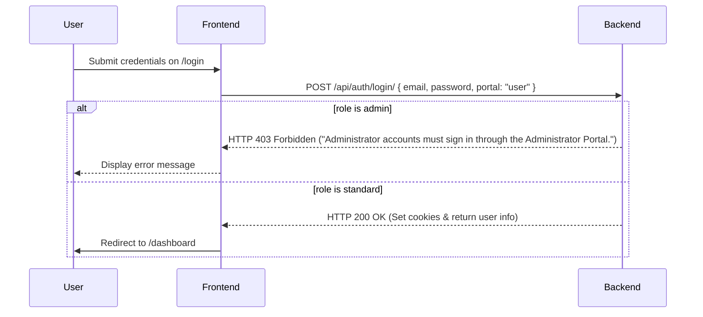
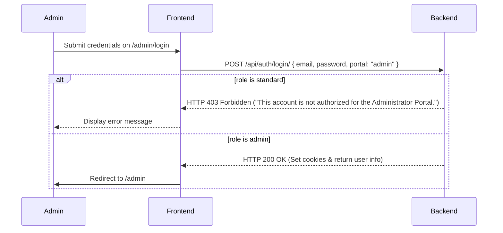

# Walkthrough - Authentication & Portal Isolation Fixes

All bugs and requirements have been audited, addressed, and successfully verified.

## 1. Root Cause of Each Issue

1. **Administrator accounts authenticating through User Login (/login)**: The backend API `login_view` checked `portal == "user" and user.role == "admin"`, raising `AuthenticationFailed` with status code 403. However, `AuthenticationFailed` inherits from `APIException` which does not support the `status_code` argument, resulting in incorrect responses or potential unhandled/improperly formatted exceptions. The Google OAuth view did not inspect `portal` at all, allowing social authentication for admin accounts.
2. **Standard users authenticating through Admin Login (/admin/login)**: Same as above. The `login_view` raised `AuthenticationFailed("This account is not an administrator account.", status_code=403)` which returned the wrong message.
3. **Standard user visit to /admin/login redirects to /profile**: When a standard user was logged in, visiting `/admin/login` triggered the `GuestGuard` which redirected them to `ROUTES.DASHBOARD` (which in turn redirected to `/profile` if onboarding was incomplete).
4. **Admin visit to /login fails to isolate session**: Similar to issue 3, there was no custom guard check for user routes, so a logged-in admin going to `/login` would not be cleanly redirected or isolated from standard user workspace views.
5. **Switch to User Portal button**: The `AdminLayout.jsx` contained a hardcoded button to navigate to `ROUTES.DASHBOARD`, enabling administrators to access the User Portal while authenticated under their administrator credentials.
6. **Administrator access to user URLs**: The standard user workspace paths in `App.jsx` were wrapped by `AuthGuard` which only verified `isAuthenticated == true`, allowing logged-in admin users to navigate to `/profile`, `/dashboard`, `/resumes`, etc.
7. **User access to administrator routes**: Standard users could hit `/admin` and only be blocked by `AdminGuard` which returned a redirect to `/admin/access-denied`.
8. **Authentication guards relying only on authentication**: The frontend routes relied on `AuthGuard` which checked `isAuthenticated` but did not validate the roles of the users.

---

## 2. Files Modified

### Backend:
- **[views.py](file:///c:/Users/marat/OneDrive/Desktop/carvion-ai/carvion_backend/apps/authentication/views.py)**:
  - Imported `PermissionDenied` exception (which returns HTTP 403 by default).
  - Updated `login_view` to raise `PermissionDenied` with the exact requested messages:
    - Standard login: `"Administrator accounts must sign in through the Administrator Portal."`
    - Admin login: `"This account is not authorized for the Administrator Portal."`
  - Updated `google_oauth_view` to support the `portal` parameter and enforce the same role-based portal rules as `login_view`.
- **[serializers.py](file:///c:/Users/marat/OneDrive/Desktop/carvion-ai/carvion_backend/apps/authentication/serializers.py)**:
  - Added `portal` field to `GoogleOAuthSerializer` to accept the portal parameter.

### Frontend:
- **[App.jsx](file:///c:/Users/marat/OneDrive/Desktop/carvion-ai/carvion_frontend/src/App.jsx)**:
  - Imported `UserGuard`.
  - Wrapped user workspace paths with `UserGuard` instead of `AuthGuard`.
  - Cleaned up admin routes wrapping to use the self-contained `AdminGuard` directly.
- **[UserGuard.jsx](file:///c:/Users/marat/OneDrive/Desktop/carvion-ai/carvion_frontend/src/core/guards/UserGuard.jsx)**:
  - **[NEW]** Created `UserGuard` to protect user-only routes, checking both `isAuthenticated` and `role === ROLES.STANDARD || role === 'user'`. Redirects admins to `/admin`.
- **[AdminGuard.jsx](file:///c:/Users/marat/OneDrive/Desktop/carvion-ai/carvion_frontend/src/core/guards/AdminGuard.jsx)**:
  - Updated to make it self-contained: checks `isAuthenticated` (redirects to `/admin/login` if not logged in) and `role === ROLES.ADMIN` (redirects to `/admin/access-denied` if not admin).
- **[GuestGuard.jsx](file:///c:/Users/marat/OneDrive/Desktop/carvion-ai/carvion_frontend/src/core/guards/GuestGuard.jsx)**:
  - Added check: if standard user attempts to visit a page starting with `/admin` (e.g. `/admin/login`), redirect to `/admin/access-denied`.
- **[AdminLayout.jsx](file:///c:/Users/marat/OneDrive/Desktop/carvion-ai/carvion_frontend/src/core/layouts/AdminLayout.jsx)**:
  - Removed "Switch to User Portal" button.
  - Added a functional "Sign Out" button that signs the admin out and navigates directly to `/admin/login`.
- **[MainLayout.jsx](file:///c:/Users/marat/OneDrive/Desktop/carvion-ai/carvion_frontend/src/core/layouts/MainLayout.jsx)**:
  - Updated `handleLogout` to redirect standard users to `/login` instead of the landing page.
- **[PublicNavbar.jsx](file:///c:/Users/marat/OneDrive/Desktop/carvion-ai/carvion_frontend/src/features/public/components/PublicNavbar.jsx)**:
  - Updated `handleLogout` to redirect standard users to `/login`.
- **[Login.jsx](file:///c:/Users/marat/OneDrive/Desktop/carvion-ai/carvion_frontend/src/features/auth/pages/Login.jsx)**:
  - Updated Google OAuth payload to send `{ token, portal: "user" }` to enforce role constraints.

---

## 3. Authentication Flow after Fixes

### User Login Flow (/login):

### Admin Login Flow (/admin/login):

### Route Protection Flow:
- **Standard User routes** are guarded by `UserGuard`. If a logged-in admin tries to open `/profile`, `/dashboard`, etc., they are redirected to `/admin`. If an unauthenticated user enters them, they go to `/login`.
- **Admin routes** are guarded by `AdminGuard`. If a logged-in standard user enters `/admin`, they are redirected to `/admin/access-denied`. If an unauthenticated user enters them, they go to `/admin/login`.

---

## 4. Verification Results

- `python manage.py check`: **Passed** (System check identified no issues).
- `npm run build`: **Passed** (Successfully built production package without compilation errors).
