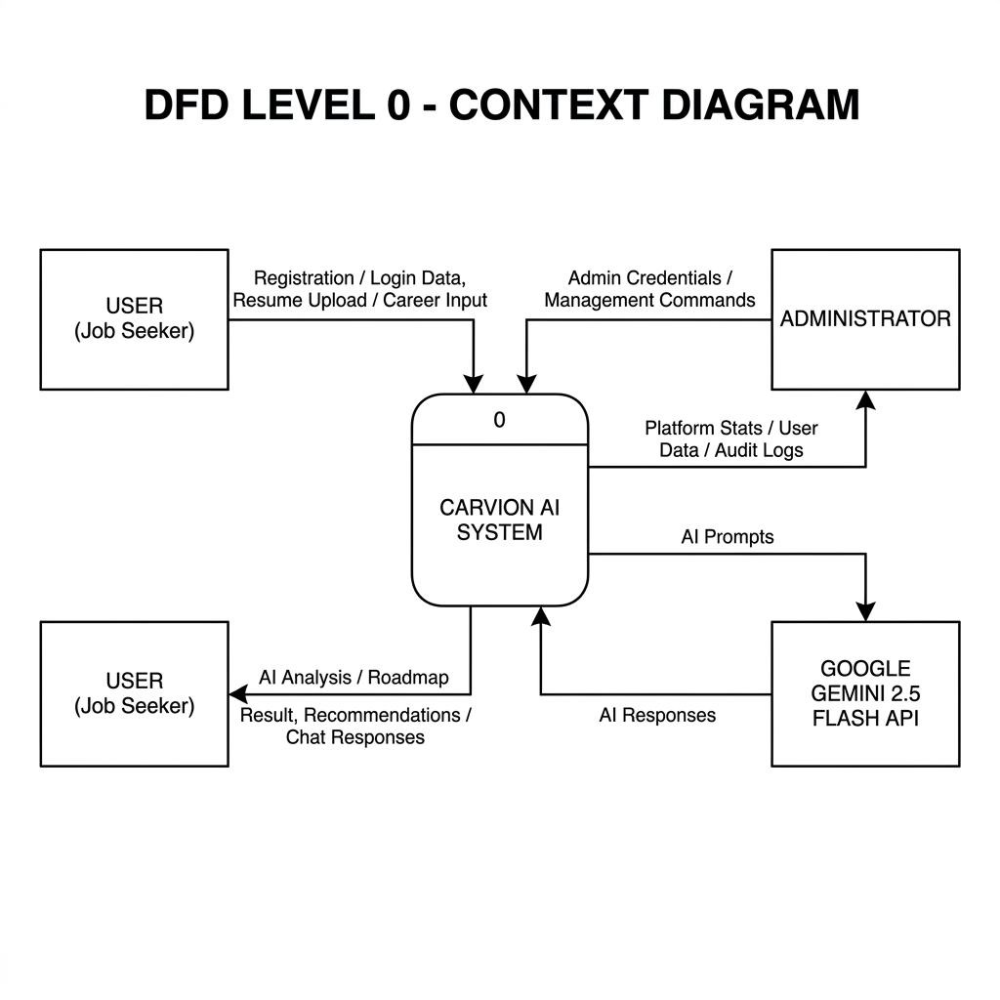
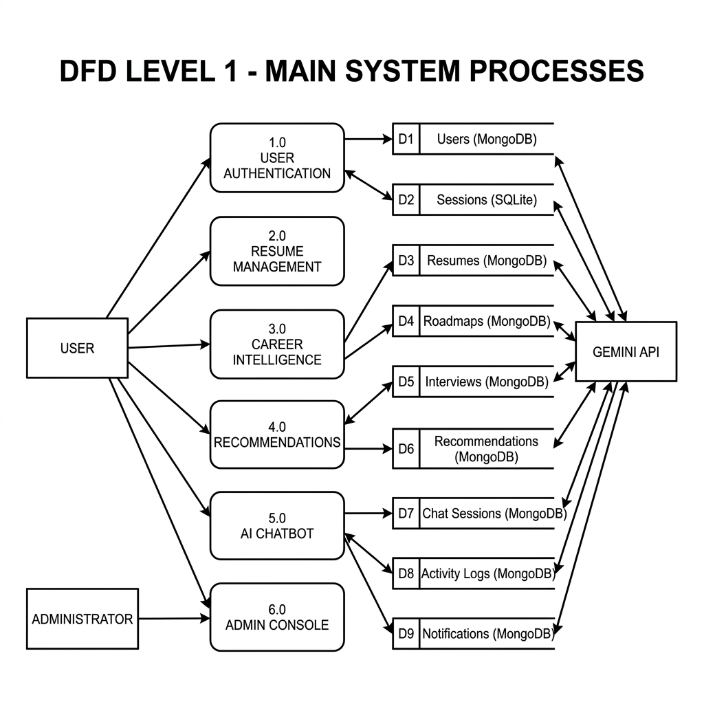
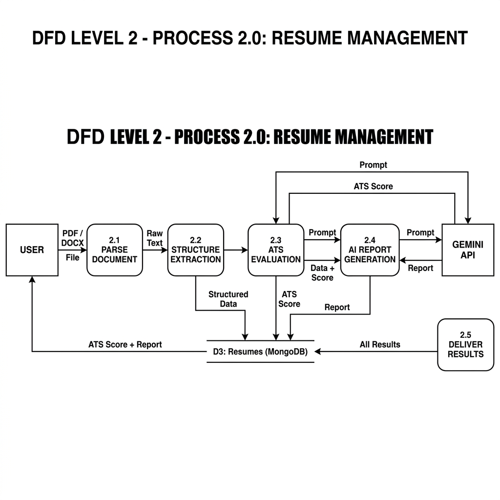
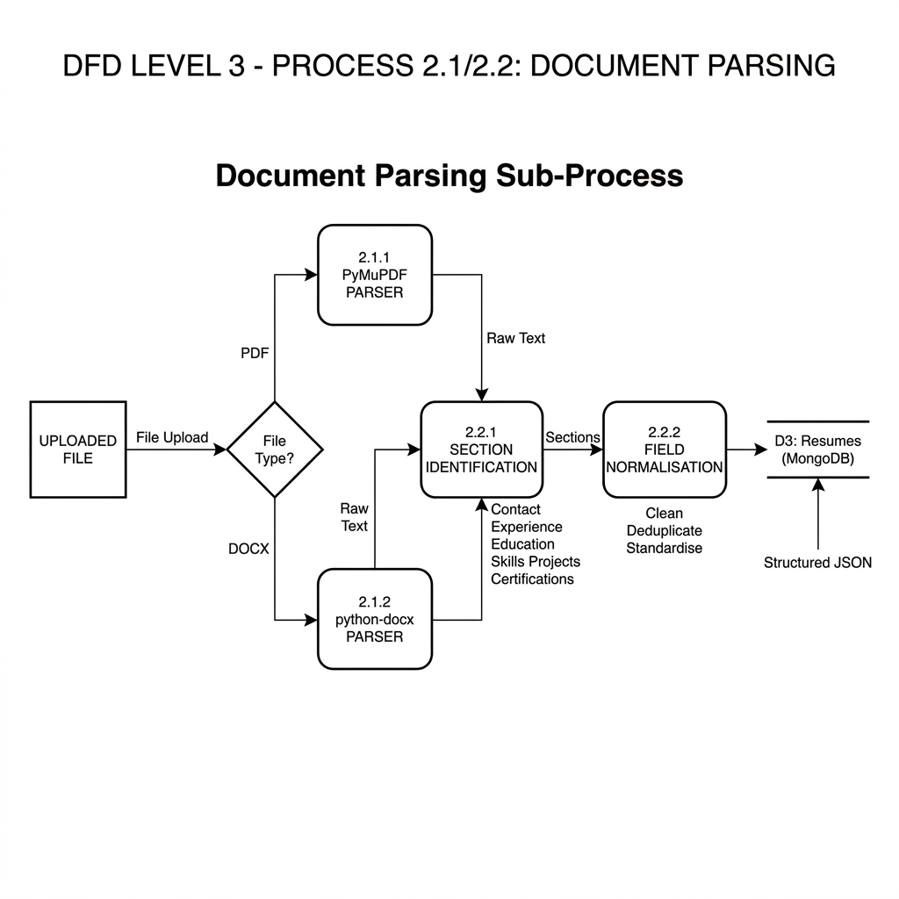
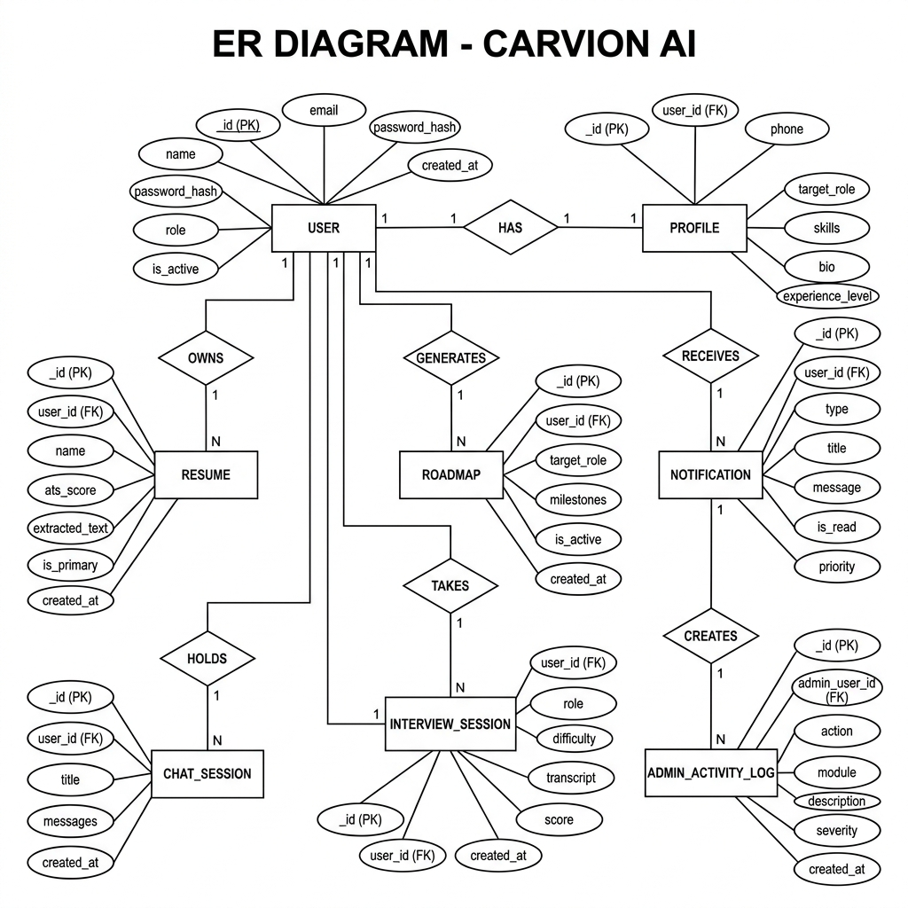

# Carvion AI: Full-Stack AI-Powered Career Development Platform
## Presentation Slides Outline (ppt.md)

---

### **Slide 1: Title Slide**
* **Project Title:** Carvion AI
* **Subtitle:** Design, Implementation, and Evaluation of a Decoupled, AI-Powered Career Development Platform
* **Presented By:** [Your Name / Team Name]
* **Course/Degree:** [e.g., Bachelor of Technology / Computer Science Project]
* **Date:** July 2026

---

### **Slide 2: Introduction — The Problem Statement**
* **Fragmented Tool Ecosystem:** 
  * Job seekers are forced to use multiple, disconnected tools: one for resume formatting, another for job search, and separate portals for online courses and mock interview practices.
  * This fragmentation leads to a loss of unified career context and user fatigue.
* **Static Resume Builders:**
  * Standard builders design templates but lack intelligence to evaluate content or verify compatibility with automated Applicant Tracking Systems (ATS).
* **High Mentorship Costs:**
  * Accessing professional, personalized career guidance and mock interview prep from human coaches is expensive and cannot scale.

---

### **Slide 3: Introduction — The Carvion AI Solution**
* **Unified Career Workspace:**
  * Integrates resume analysis, custom learning path planning, mock interview simulators, job/course recommendations, and chatbot support into one cohesive application.
* **Always-Available AI Mentor:**
  * Leverages Google Gemini 2.5 Flash to deliver immediate, personalized, and actionable guidance at scale.
* **Context-Driven Adaptation:**
  * Maintains a shared user profile that automatically updates based on resume uploads, mock interview scores, and completed milestones to adapt recommendations.

---

### **Slide 4: Project Objectives (Part 1)**
* **Objective 1: AI Resume Intelligence**
  * Build a pipeline to parse PDF/DOCX resumes, extract key sections, evaluate ATS compatibility scores, and deliver structured improvement recommendations.
* **Objective 2: Dynamic Career Roadmaps**
  * Generate personalized, step-by-step learning milestones and skill acquisition pathways aligned with a user's target career role.
* **Objective 3: Mock Interview Simulator**
  * Establish an interactive Q&A sandbox that evaluates free-form candidate answers and provides scored feedback on communication and content quality.

---

### **Slide 5: Project Objectives (Part 2)**
* **Objective 4: Contextual Recommendation Engine**
  * Match user skills and goals to relevant job opportunities and online courses to bridge identified skill gaps.
* **Objective 5: Conversational AI Chatbot**
  * Integrate an embedded chat assistant to answer career-related questions and explain resume feedback.
* **Objective 6: Enterprise Admin Console**
  * Design a real-time administrative dashboard powered by live data to monitor user lifecycles, audit admin actions, and broadcast notifications.
* **Objective 7: Decoupled Full-Stack Architecture**
  * Implement clean separation of concerns using a React SPA frontend and a Django REST Framework backend API.

---

### **Slide 6: Purpose of the Project**
* **Democratize Career Guidance:**
  * Remove financial and geographical barriers, making high-quality career mentoring available to job seekers of all backgrounds.
* **Streamline the Job Preparation Journey:**
  * Convert a series of isolated, repetitive prep tasks into a continuous, guided learning loop.
* **Demonstrate Applied AI Engineering:**
  * Provide a production-ready model showing how to integrate standard web frameworks (React, Django, MongoDB) with generative AI APIs (Gemini).

---

### **Slide 7: Scope of the Project**
* **In-Scope (Current Implementation):**
  * Secure user registration, login, and profile tracking with JWT token rotation.
  * Local parser parsing raw text from PDF and DOCX document formats.
  * AI evaluation modules for resumes, roadmaps, mock interviews, and chatbots.
  * Admin control panel featuring real-time KPI metrics, notification broadcasts, and maintenance controls.
* **Out-of-Scope (Future Iterations):**
  * Integrated payment processing systems.
  * Native mobile application wrapper (Android/iOS).
  * Video-based facial emotion tracking or live audio/voice analysis.

---

### **Slide 8: Decoupled System Architecture**
* **Frontend Single Page Application (SPA):**
  * React + Vite frontend handles client-side routing, dashboard visualization, UI state management, and file uploads.
* **Stateless Backend API:**
  * Django REST Framework (DRF) manages request validation, business logic, JWT authentication, and external API requests.
* **JSON RESTful API Interface:**
  * Components communicate purely via JSON payloads over HTTP, ensuring a clean decoupling of layout and business logic.
* **Dual Database System:**
  * SQLite persists metadata (admin sessions, token blacklists) while MongoDB stores all user-generated profiles, resumes, and AI outputs.

---

### **Slide 9: Frontend Architecture & Technologies**
* **React (v18):** Core component framework chosen for its declarative rendering and modular component tree.
* **Vite:** High-performance toolchain and build dev server replacing Webpack to enable fast Hot Module Replacement (HMR).
* **React Router DOM:** Controls client routing and protects dashboard/admin modules from unauthenticated visitors.
* **TanStack Query (React Query):** Manages server state, automated background re-fetching, and caches API payloads to reduce server load.
* **Recharts:** Composable SVG charting library to build analytics graphs showing user progress and admin KPIs.
* **Axios:** HTTP client equipped with interceptors to automatically append JWT headers and retry failed requests using refresh tokens.
* **Vanilla CSS:** Fully custom styles supporting responsive flex grids, glassmorphism, transitions, and dark/light modes.

---

### **Slide 10: Backend Architecture & Technologies**
* **Python (v3.11) & Django (v4.x):** Foundation providing secure project architecture, configuration schemas, and base model structures.
* **Django REST Framework (DRF):** Simplifies view routing, permissions enforcement, input validation, and data serialization into JSON.
* **Simple JWT:** DRF extension providing secure JWT authentication, refresh token rotation, and logging out via token blacklists.
* **MongoEngine:** Python Object Document Mapper (ODM) used to interface with MongoDB collections using Django-like syntax.
* **Document Parsers:** `PyMuPDF (fitz)` (PDF text extraction) and `python-docx` (DOCX extraction).
* **Google Generative AI SDK:** Connects backend functions directly to Google Gemini 2.5 Flash for inference processing.

---

### **Slide 11: Database Design & Models**
* **Dual-Database Selection:**
  * **MongoDB (Primary):** Selected for its schema flexibility, allowing easy storage of complex, nested JSON payloads generated by Gemini (roadmaps, feedback reports, interview transcripts).
  * **SQLite (Secondary):** Lightweight relational database handling Django sessions and django-admin metadata.
* **Relationship Management:**
  * Handled via MongoEngine `ReferenceField` references across collections.
  * Cascade deletion rules configured to clean up dependent documents when user accounts are deleted.
  * MongoDB TTL (Time-To-Live) indexes applied to automated refresh token pruning and Job search caches.

---

### **Slide 12: Security Architecture**
* **JWT Authentication:** Requests to protected views are intercepted and verified against cryptographic signatures.
* **Role-Based Access Control (RBAC):** Custom DRF permission classes verify user roles, restricting standard users from administrative endpoints.
* **Password Hashing:** Enforced via bcrypt encryption, ensuring credentials are never stored or transmitted in plain text.
* **Input Sanitization & API Throttling:** Prevent injection vulnerabilities on user fields and restrict high-cost AI endpoints to prevent denial-of-service (DoS) attempts.
* **Security Logs:** Centralized Python logging configuration utilizing a size-based `RotatingFileHandler` to track system and security events.

---

### **Slide 13: Feature: Resume Intelligence**
* **Document Upload & Parsing:**
  * Accepts PDF and DOCX uploads. Backend extracts raw text using PyMuPDF and python-docx.
* **NLP Structure Extraction:**
  * Classifies extracted paragraphs into structured segments (contact, experience, education, skills, projects, certifications).
* **Gemini ATS Evaluation:**
  * Structured prompt sends parsed data to Gemini 2.5 Flash, generating a numerical ATS compatibility score and a detailed report targeting missing keywords, typos, and formatting flaws.
* **Interactive Builder:**
  * Guided builder form allows manual resume creation and exports optimized PDF formats.

---

### **Slide 14: Feature: Career Roadmaps & Recommendations**
* **AI Career Roadmaps:**
  * Collects user's current skills and target role, prompting Gemini to output a milestone timeline.
  * Milestones detail timeframe, targeted skills to learn, resource links, and progress indicators.
* **Job Recommendation Engine:**
  * Fetches postings via the JSearch API using target role and location. Results are cached in MongoDB with a TTL index.
* **Curated Course Recommendations:**
  * Matches skill gaps identified during resume checks with online learning courses to help users achieve milestones.

---

### **Slide 15: Feature: Mock Interviews & Chatbot**
* **Mock Interview Simulator:**
  * Users set target roles and difficulty. Gemini generates custom questions.
  * Free-form text answers are evaluated by Gemini, scoring content relevance and communication clarity.
  * Session histories are persisted in MongoDB for progress review.
* **Embedded AI Chatbot:**
  * Career assistant available across pages, running on Gemini with system prompts restricting conversations to professional career topics.

---

### **Slide 16: Feature: Enterprise Admin Console**
* **Live KPI Dashboard:**
  * Displays signups, active users, resume submissions, and AI counts using real-time MongoDB aggregation queries.
* **User Management:**
  * Provides searching, profile inspection, and options to activate/deactivate accounts.
* **System Operations:**
  * Toggles maintenance modes, flushes application cache, and broadcasts system-wide notifications.
* **Admin Audit Logs:**
  * Logs all administrative actions (timestamp, user, action details, IP address) for tracking.

---

### **Slide 17: Context Flow Diagram (DFD Level 0)**
* **Explanation:**
  * Shows the system boundary, mapping **Carvion AI Platform (Process 0)** as a single entity.
  * **Interactions:**
    * **User:** Submits logins, resumes, and queries; receives roadmaps, feedback, and job postings.
    * **Administrator:** Manages system settings; receives KPI analytics.
    * **Gemini API:** Receives system prompts; returns analyzed JSON formats.
* **Diagram:**
  

---

### **Slide 18: DFD Level 1: Main System Processes**
* **Explanation:**
  * Decomposes the central process into its core components: Authentication (1.0), Resume Management (2.0), Roadmaps (3.0), Mock Interviews (4.0), Chat (5.0), Recommendations (6.0), and Admin Console (7.0).
  * Details how processes connect to MongoDB collections (D1, D3-D9) and the SQLite session database (D2).
* **Diagram:**
  

---

### **Slide 19: DFD Level 2: Resume Management**
* **Explanation:**
  * Breaks down the **Resume Management (2.0)** process into:
    * **2.1 Parse Document:** Read uploaded files.
    * **2.2 Structure Extraction:** Categorize text into resume fields.
    * **2.3 ATS Evaluation:** Estimate compatibility score using Gemini.
    * **2.4 AI Report:** Produce detailed suggestions.
    * **2.5 Deliver Results:** Send score and report to the user dashboard.
* **Diagram:**
  

---

### **Slide 20: DFD Level 3: Document Parsing Details**
* **Explanation:**
  * Focuses on the parsing sub-processes (**2.1 and 2.2**).
  * Maps the path splitting: PDF text extraction via PyMuPDF (2.1.1) versus DOCX paragraph reading via python-docx (2.1.2).
  * Details section identification (2.2.1) and field normalization (2.2.2) converting raw strings into serialized JSON.
* **Diagram:**
  

---

### **Slide 21: Entity Relationship Diagram (ERD)**
* **Explanation:**
  * Defines structural database schema collections mapped by MongoEngine ODM.
  * **Entities:** `USER`, `PROFILE`, `RESUME`, `ROADMAP`, `INTERVIEW_SESSION`, `CHAT_SESSION`, `NOTIFICATION`, `ADMIN_ACTIVITY_LOG`, `REFRESH_TOKEN`, `MOCK_TEST`, `SCORECARD`, and `CONTACT_MESSAGE`.
  * **Cardinality:** USER has a 1:1 mapping to PROFILE, and 1:N mapping to resumes, roadmaps, interviews, and logs.
* **Diagram:**
  

---

### **Slide 22: System Verification & Testing**
* **Unit Testing:**
  * Validates JWT token validations, document extraction success, ATS score boundary calculations, and CRUD actions.
* **Integration Testing:**
  * Verifies data loops between React handlers, Django APIs, MongoDB collections, and Gemini API calls.
* **System Testing:**
  * End-to-end testing of user flows: registration, uploading resumes, tracking milestones, mock interview practice, and dashboard updates.
* **Security & Performance Testing:**
  * Confirms input sanitization, RBAC restriction blocks, and latency limits (APIs respond < 2s, AI inferences < 15s).

---

### **Slide 23: Limitations of the Platform**
* **External API Dependency:**
  * Heavy reliance on Google Gemini API means core intelligence features fail if the API goes offline.
* **Format Restrictions:**
  * Scanned image-based PDFs cannot be parsed directly, producing empty text extractions.
* **No Real-Time Server Push:**
  * Employs polling state re-fetching, lacking WebSocket connections for instant notifications.
* **Language Support:**
  * Limited to English text inputs and AI prompt inferences.
* **Development Server Limits:**
  * Run on single-process development servers, lacking stress testing on Gunicorn/Nginx.

---

### **Slide 24: Future Scope & Enhancements**
1. **Native Mobile App:** Build Android/iOS apps using React Native with native push notifications.
2. **WebSocket Integration:** Use Django Channels for real-time notification streaming and token-by-token chatbot responses.
3. **Advanced Mock Interviews:** Support video uploads with facial expression analysis and tone tracking.
4. **Targeted Job Matching:** Add job description inputs to target specific resume keywords gap analysis.
5. **Cloud Scaling:** Migrate to containerized Docker deployments on AWS/Kubernetes and MongoDB Atlas.

---

### **Slide 25: Conclusion**
* **Achievements:**
  * Unified fragmented career preparation tools into one context-aware web application.
  * Validated a decoupled full-stack architecture using React, Django, and MongoDB.
  * Maintained high standards of security via JWT token rotation and detailed audit logs.
* **Final Takeaway:**
  * Carvion AI successfully demonstrates that applied AI systems, when paired with clean engineering practices, can democratize career guidance and bridge candidate potential with industry readiness.
